# CV Super Resolution Python Project

## 1. Models
### flow chart
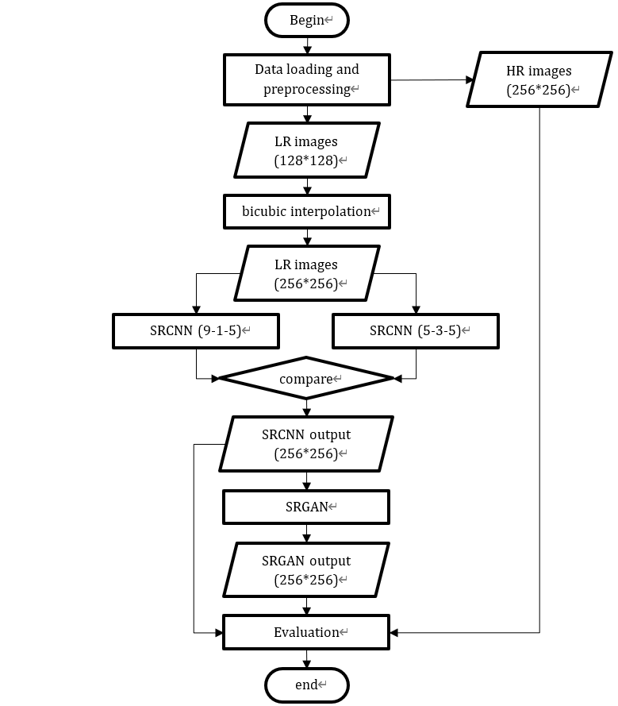

### SRCNN
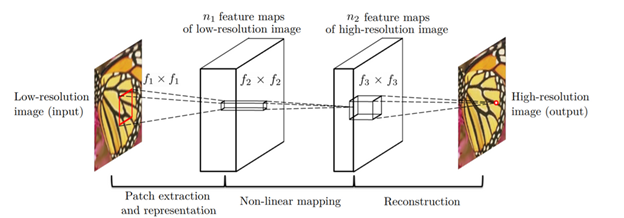

### SRGAN
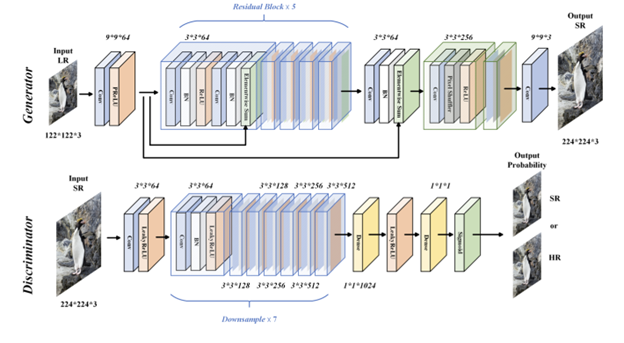

## 2. Training curves
### SRCNN(9-1-5)
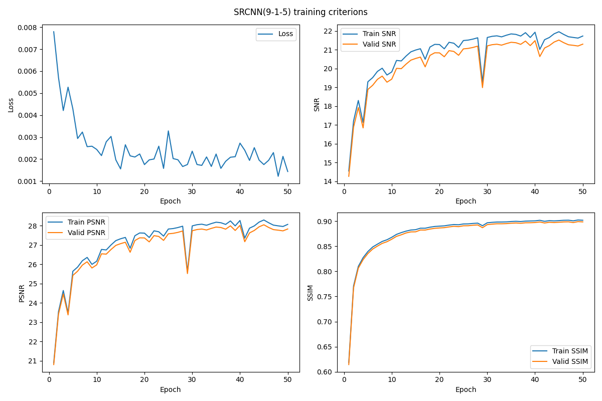
### SRCNN(5-3-5)
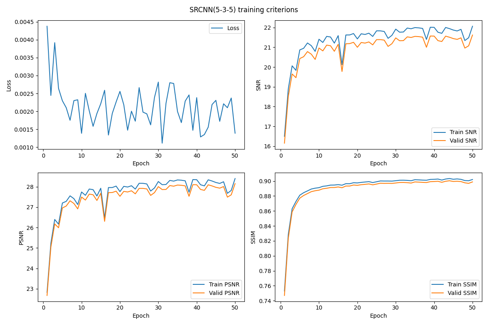
### SRGAN Curves
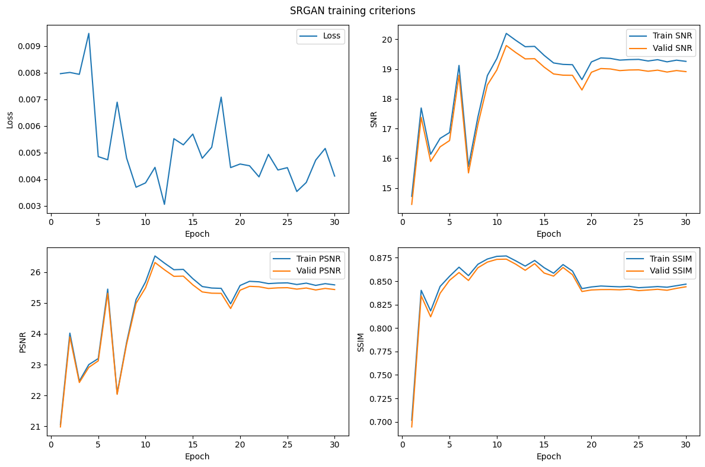

## 3. Example images
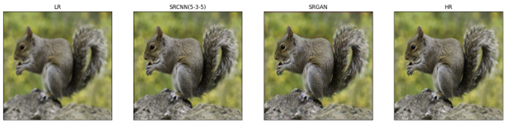
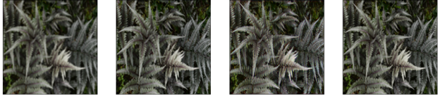
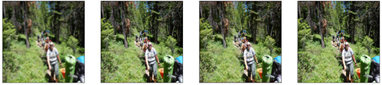
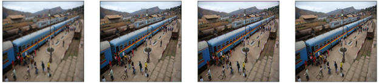

## 4. Folders
The project constains 5 folders.
- data: DIV2K dataset and code of splitting the train dataset into train and validation
- SRCNN: code and model of SRCNN
- SRGAN: code and model of SRGAN
- saved_model: the best trained models
- result: training peremeters tables, training results plots and related images

### data
- data folder is the transformation of dataset DIV2K. It contains three subfolders named train, val, and test to store corresponding datasets.  
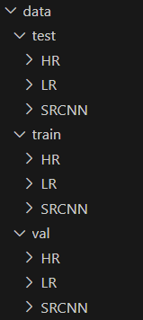
- Original images are in HR and LR folders. Model outputs are in SRCNN folder.  
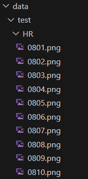
- dataPrepare.ipynb: Split the original train dataset into new train dataset with 550 images and val dataset with 250 images. Rename the original valid dataset as new test dataset.

### SRCNN
- SRCNN_training_2.0.ipynb: the main code to train and evaluate the SRCNN
- SRCNN_data_loading.py: load train, validation, and test dataset from the Data folder
- SRCNN_image_show.py: class to plot the output images
- SRCNN_logger.py: class to record training criterions (Loss, SNR, PSNR, SSIM) and plot
- SRCNN1.py: define the model class SRCNN(9-1-5)
- SRCNN2.py: define the model class SRCNN(5-3-5)

### SRGAN
- SRGAN_training_1.0.ipynb: the main code to train and evaluate the SRGAN
- SRGAN_data_loading.py: load train, validation, and test dataset from the Data folder
- SRGAN_image_show.py: class to plot the output images
- SRGAN_logger.py: class to record training criterions (Loss, SNR, PSNR, SSIM) and plot
- SRGAN.py: define the model class SRGAN

### saved_model
- best_model_915: the peremeters of the best SRCNN(9-1-5)
- best_model_915: the peremeters of the best SRCNN(5-3-5)
- best_SRGAN_generator: SRCNN(9-1-5)

## 5. Deployment
* Put the DIV2K dataset into the Data folder, then run dataPrepare.ipynb  
* SRCNN & SRGAN Training: run the corresponding code of .ipynb. The model peremeters will be automatically saved in saved_model folder for test evaluation in the code. If the folder does not exist, the code will create first.  
* The code could use .csv files to plot the model performance and save it as .png files.

